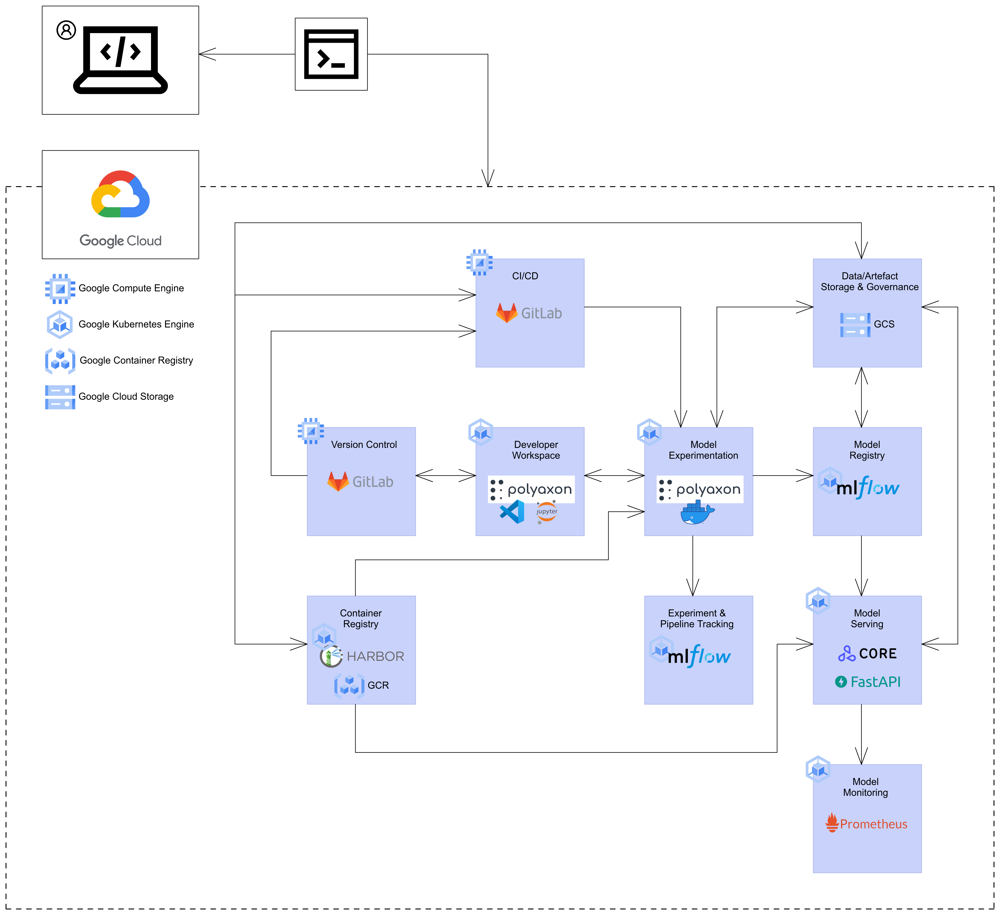

# MLOps Components & Platform

## Components Flowchart

The images below showcase the different components that this guide
will cover as well as how each of them relate to each other.

!!! info
    The diagrams follow the
    [C4 model](https://c4model.com/)
    for visualising and describing
    software architecture.

### Context View


### Containers View



## Kubernetes

We will be using
[Kubernetes](https://kubernetes.io/)
as the underlying orchestration tool to execute
pipelines and manage containerised applications and environments.

From the Kubernetes site:

> _Kubernetes, also known as K8s, is an open-source system for automating_
> _deployment, scaling, and management of containerized applications._
> _It groups containers that make up an application into logical units_
> _for easy management and discovery._

A number of services and applications that you will be interacting with
(or deploying) are deployed (to be deployed) within a GKE cluster
environment. A GKE cluster should be set up upon creation of your GCP
project, viewable
[here](https://console.cloud.google.com/kubernetes/list/overview).
If this is not the case, please notify the MLOps team at
`mlops@aisingapore.org`.

Some of the MLOps components which the GKE environment will be
relevant for are:

- Developer Workspace
- Model Experimentation
- Experiment Tracking
- Data/Artifact Storage
- Model Serving

What this means is that AI engineers would need to be able to access the
GKE cluster. Documentation for obtaining a cluster's configuration can
be found
[here](https://cloud.google.com/kubernetes-engine/docs/how-to/cluster-access-for-kubectl#generate_kubeconfig_entry).

### `kubectl` Configuration for GKE

If you would like to view or create Kubernetes (GKE) resources within
development environments (or even on your own local machine), you can
run the following command to connect to the GKE
cluster which by default
your user or service account
should have access to:

```bash
$ gcloud container clusters get-credentials <NAME_OF_CLUSTER> --zone asia-southeast1-c --project {{cookiecutter.gcp_project_id}}
```

After obtaining the credentials and configurations for the GKE cluster,
you can start to interact with the main MLOps platforms tool that you
will be leveraging on for a development workspace, data preparation as
well as model training.

!!! caution

    Non-staff engineer accounts or service accounts are granted limited
    permissions. One would not be able to carry out certain actions with
    the clusters such as viewing namespaces or deleting cluster
    resources.

__Reference(s):__

- [GKE Overview](https://cloud.google.com/kubernetes-engine/docs/concepts/kubernetes-engine-overview)

### Persistent Volumes

Containers are ephemeral and what that translates to is that any data
created and stored within the containers' file systems as well as any
changes made to
it will be gone once the container is stopped. To persist data or files,
we would need to mount volumes to the containers. With the default
configuration provided in this template, any services or jobs to be
spun up on the MLOps platform Polyaxon will have a persistent volume
attached. The volume's mount path is `/polyaxon-v1-data` and so
anything that is stored within that path will be persisted.

__Reference(s):__

- [Kubernetes Docs - Volumes](https://kubernetes.io/docs/concepts/storage/volumes/)
- [NetApp - What are Kubernetes persistent volumes?](https://www.netapp.com/knowledge-center/what-is-kubernetes-persistent-volumes/)

## Polyaxon

[Polyaxon](https://polyaxon.com) is an MLOps platform that provides a
suite of features for AI engineers to facilitate their end-to-end
machine learning workflows. The platform is to be deployed on a GKE
cluster; the Platforms team would have set the platform up for
your team upon creation of the GCP project. AI engineers need not worry
about having to administer the platform as end-consumers of the
platform.

To verify if Polyaxon has been deployed on your GKE cluster,
you can run the following command:

```bash
$ helm list --namespace polyaxon-v1
NAME            NAMESPACE       REVISION        UPDATED                       STATUS          CHART           APP VERSION
polyaxon        polyaxon-v1     X               2021-XX-XX XX:XX:XX +0800 +08 deployed        polyaxon-1.11.3 1.11.3
```

An output similar to the one above should be returned.

### Polyaxon Dashboard

Now, let's access the dashboard for Polyaxon. Before we can interact
with the platform, we have to install the Polyaxon CLI. This should
ideally be done within a virtual Python environment. You can
conveniently get the relevant libraries for this guide by executing the
following command within the repository:

```bash
$ conda env create -f {{cookiecutter.repo_name}}-conda-env.yml
```

At any point of time you would like __to interact with the Polyaxon
server, you would need port forwarding of the Polyaxon Kubernetes
service to your localhost__.
You can do port forwarding to a port on the localhost with
the Polyaxon CLI (we'll go ahead with the port `8117`):

```bash
$ polyaxon port-forward --port=8117 --namespace=polyaxon-v1
```

!!! tip
    The above process would occupy your current terminal. If you'd like
    the process to run in the background instead of opening up another
    terminal window/tab, you can run the following commands:

    === "Linux/macOS"

        ```bash
        $ polyaxon port-forward --port=8117 --namespace=polyaxon-v1 & > /dev/null 2>&1 &
        ```

    === "Windows PowerShell"

        ```powershell
        $ Start-Process polyaxon -ArgumentList "port-forward --port=8117 --namespace=polyaxon-v1"
        ```

    However, for Linux/macOS, to end these processes that are running in
    the background,
    you cannot simply abort the process by using `Ctrl + C`. Do look
    at
    [this resource](https://itsfoss.com/how-to-find-the-process-id-of-a-program-and-kill-it-quick-tip/)
    on how to kill running (background) processes.

Open up a browser and head over to `localhost:8117`. You should see an
interface as such:


Before we can create any services or run jobs on the platform, we have
to configure the host for the CLI and create a project within the
platform:

```bash
$ polyaxon config set --host=http://localhost:8117
$ polyaxon project create --name {{cookiecutter.repo_name}}-<YOUR_NAME>
```

After the command above, you should see a project with the name you've
specified above in the
[projects dashboard](http://localhost:8117/ui/orgs/default/projects).

__Reference(s):__

- [Ampersands & on the command line](https://bashitout.com/2013/05/18/Ampersands-on-the-command-line.html)

### Relevant Concepts

Before we proceed further, let's cover some basic concepts that one
should know when getting started with Polyaxon.

__Polyaxonfiles:__

To submit jobs or spin up services on the Polyaxon platform, users would
have to make use of both the CLI as well as Polyaxon-specific config
files known as Polyaxonfiles. The CLI establishes communications and
connections with the Polyaxon server while Polyaxonfiles provide
specification to the server for the kind of request you are making.
Polyaxonfiles can be written and defined in several formats
(YAML, JSON, Python, and some other languages) but in
AI Singapore's context, we will be sticking with YAML.
Polyaxonfile boilerplates can be found under
`aisg-context/polyaxon/polyaxonfiles`.

Head over [here](https://polyaxon.com/docs/core/specification/) for the
official documentation on Polyaxonfiles.

__Components:__

Before you can define a job or service for Polyaxon, you would have to
call upon and define a component. Hence, in every Polyaxonfile that is
provided as an example, you see the following lines
at the very beginning:

```yaml
version: 1.1
kind: component
...
```

From the official documentation:

> _Component is a discrete, repeatable, and self-contained action that_
> _defines an environment and a runtime._

Essentially, a "component" is to represent a discrete aspect of your
end-to-end workflow. You can have one component for your development
environment, one for your data preparation pipeline, and another for
your model training workflow. You can also have different components for
different variations of your pipelines. However, for these workflows to
be defined, we have to start with specifying a component.
Shown [here](https://polyaxon.com/docs/intro/concepts/runtime-concepts/),
you can specify various runtimes
(experimentation tools) you would like to spin up on the Polyaxon
server.

__Reference(s):__

- [Polyaxon Docs - Component Specification](https://polyaxon.com/docs/intro/quick-start/components/)
- [Polyaxon Docs - Polyaxon experimentation tools](https://polyaxon.com/docs/experimentation/)

__Jobs:__

One example of such components is "jobs". You can run jobs for training
models, data preprocessing or any generic tasks that are executable
within Docker containers. Whenever you need to execute a pipeline or a
one-off task, "jobs" is the right runtime to go for.

__Reference(s):__

- [Polyaxon Docs - Jobs Introduction](https://polyaxon.com/docs/experimentation/jobs/)

__Services:__

The "services" runtime is used for spinning up applications or
interfaces that are to remain running until you stop the service
(or an error is faced on the server's end).
You can spin up services the likes of a VSCode editor that would
be accessible via a browser, a Jupyter Lab server or a REST API server.

__Reference(s):__

- [Polyaxon Docs - Services Introduction](https://polyaxon.com/docs/experimentation/services/)

We will dive deeper into these concepts and the usage of each one of
them in later sections.

### Secrets & Credentials on Kubernetes

When executing jobs on Polyaxon, credentials are needed to access
various services like GCR or GCS. To provide your container jobs with
access to these credentials, you need to carry out the following:

1. Download a service account key to your local machine (or obtain it
   from the lead engineer/MLOps team) and rename it to
   `gcp-service-account.json`. Take note of the client email detailed
   in the JSON file. The client email should look something like
   the following:
   `<SA_CLIENT_EMAIL_FROM_SA_KEY>@{{cookiecutter.gcp_project_id}}.iam.gserviceaccount.com`.
1. Create a Kubernetes secret on your Kubernetes (GKE) cluster,
   within the same namespace where Polyaxon is deployed: `polyaxon-v1`.
2. Configure Polyaxonfiles to refer to these secrets.

Before creating the secrets, do check if they already exist first:

=== "Linux/macOS"

    ```bash
    $ kubectl get secret --namespace=polyaxon-v1 | grep -E 'gcp-imagepullsecrets|gcp-sa-credentials'
    ```

=== "Windows PowerShell"

    ```bash
    $ kubectl get secret --namespace=polyaxon-v1 | Select-String "gcp-imagepullsecrets"
    $ kubectl get secret --namespace=polyaxon-v1 | Select-String "gcp-sa-credentials"
    ```

Here are the commands to be executed for creating the secrets:

=== "Linux/macOS"

    ```bash
    $ export SA_CLIENT_EMAIL=<SA_CLIENT_EMAIL_FROM_SA_KEY>
    $ export PATH_TO_SA_JSON_FILE=<PATH_TO_SA_JSON_FILE>
    $ kubectl create secret docker-registry gcp-imagepullsecrets \
      --docker-server=https://asia.gcr.io \
      --docker-username=_json_key \
      --docker-email=$SA_CLIENT_EMAIL \
      --docker-password="$(cat $PATH_TO_SA_JSON_FILE)" \
      --namespace=polyaxon-v1
    $ kubectl create secret generic gcp-sa-credentials \
      --from-file $PATH_TO_SA_JSON_FILE \
      --namespace=polyaxon-v1
    ```

=== "Windows PowerShell"

    ```powershell
    $ $SA_CLIENT_EMAIL=<SA_CLIENT_EMAIL_FROM_SA_KEY>
    $ $PATH_TO_SA_JSON_FILE=<PATH_TO_SA_JSON_FILE>
    $ kubectl create secret docker-registry gcp-imagepullsecrets `
      --docker-server=https://asia.gcr.io `
      --docker-username=_json_key `
      --docker-email=$SA_CLIENT_EMAIL `
      --docker-password='$(cat $PATH_TO_SA_JSON_FILE)' `
      --namespace=polyaxon-v1
    $ kubectl create secret generic gcp-sa-credentials `
      --from-file $PATH_TO_SA_JSON_FILE `
      --namespace=polyaxon-v1
    ```

Make sure that the Polyaxonfiles for the jobs and services that requires
your service account credentials have the following configurations
(these snippets are included in the rendered Polyaxonfiles
by default):

```yaml
...
inputs:
  - name: SA_CRED_PATH
    description: Path to credential file for GCP service account.
    isOptional: true
    type: str
    value: /var/secret/cloud.google.com/gcp-service-account.json
    toEnv: GOOGLE_APPLICATION_CREDENTIALS
run:
  kind: job
  environment:
    imagePullSecrets: ["gcp-imagepullsecrets"]
  volumes:
    - name: gcp-service-account
      secret:
        secretName: "gcp-sa-credentials"
  container:
    volumeMounts:
      - name: gcp-service-account
        mountPath: /var/secret/cloud.google.com
...
```

By configuring and specifying the secrets in your Polyaxonfiles like
the above, you would be able to utilise the `gcloud` or `gsutil`
commands within your containerised jobs/services. Here are some
examples:

- use private Docker images from GCR to spin up jobs/services on
  Polyaxon
- uploading model artifacts to GCS buckets within model training jobs
- interact with GKE cluster(s) within Polyaxon jobs/services

__Reference(s):__

- [Kubernetes Docs - Namespaces](https://kubernetes.io/docs/concepts/overview/working-with-objects/namespaces/)

## Google Container Registry

AI Singapore's emphases on reproducibility and portability of
workflows and accompanying environments translates to heavy usage of
containerisation. Throughout this guide, we will be building Docker
images necessary for setting up development environments, jobs for
the various pipelines and deployment of the predictive model.

Within the context of GCP, the
[Google Container Registry (GCR)](https://cloud.google.com/container-registry)
will be used to store and version our Docker images.
Following authorisation to `gcloud`, you can view the image repositories
of your project's registry like so:

```bash
$ gcloud container images list --repository=asia.gcr.io/{{cookiecutter.gcp_project_id}}
```

```bash
$ gcloud container images list --repository=asia.gcr.io/{{cookiecutter.gcp_project_id}}/{{cookiecutter.author_name}}
```

You will be pushing the Docker images to the aforementioned repository.

__Reference(s):__

- [`gcloud` Reference - `gcloud container images list`](https://cloud.google.com/sdk/gcloud/reference/container/images/list)
- [GCR Guide - Pushing & Pulling Images](https://cloud.google.com/container-registry/docs/pushing-and-pulling)
