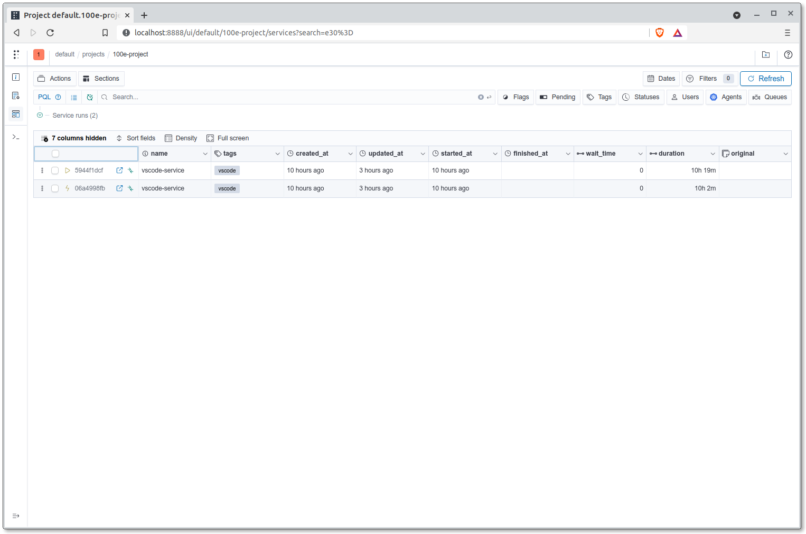
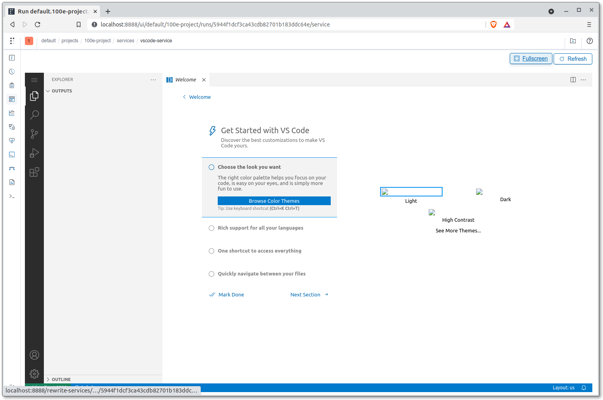

# Development Environment

An advantage presented by the Polyaxon platform is that you can utilise
the GKE cluster's resources for your development and engineering works
instead of your own resources. We can make use of
[Polyaxon services](https://polyaxon.com/docs/experimentation/services/)
to spin up VSCode or JupyterLab servers with which cluster resources
can be dedicated (except for GPUs);
all you need on your end is a machine with WebSockets,
a browser, and a terminal.

## Recommended Setup

While there exist the option for engineers to set up either a VSCode
or JupyterLab service (or both), the former would suffice. Reason
being VSCode is an excellent code editor with integrated terminal
capabilities and it can also work with Jupyter notebooks.
The JupyterLab on the other hand, while being the best interface for
Jupyter notebooks, has subpar UX for its terminal and code editor.
That is to be expected however as it is the dedicated environment
for everything related to the Jupyter ecosystem.

!!! attention
    First user of each GCP project's Polyaxon server is to begin with a
    VSCode service as it is required in setting up
    the folder for dedicated workspaces through an integrated terminal.

## VSCode

The VSCode service to be created will be using a Docker image. You
can use the Dockerfile that is provided out-of-the-box
`docker/{{cookiecutter.repo_name}}-poly-vscode.Dockerfile` to build a
Docker image to be pushed to your project's container registry (GCR) or
you can customise that same Dockerfile to your liking.
Let's build the image:

=== "Linux/macOS"

    ```bash
    $ export GCP_PROJECT_ID={{cookiecutter.gcp_project_id}}
    $ docker build \
        -t asia.gcr.io/$GCP_PROJECT_ID/vscode-server:0.1.0 \
        -f docker/{{cookiecutter.repo_name}}-poly-vscode.Dockerfile \
        --platform linux/amd64 .
    $ docker push asia.gcr.io/$GCP_PROJECT_ID/vscode-server:0.1.0
    ```

=== "Windows PowerShell"

    ```powershell
    $ $GCP_PROJECT_ID='{{cookiecutter.gcp_project_id}}'
    $ docker build `
        -t asia.gcr.io/$GCP_PROJECT_ID/vscode-server:0.1.0 `
        -f docker/{{cookiecutter.repo_name}}-poly-vscode.Dockerfile `
        --platform linux/amd64 .
    $ docker push asia.gcr.io/$GCP_PROJECT_ID/vscode-server:0.1.0
    ```

=== "Linux/macOS"

    ```bash
    $ export GCP_PROJECT_ID={{cookiecutter.gcp_project_id}}
    $ docker build \
        -t asia.gcr.io/$GCP_PROJECT_ID/{{cookiecutter.author_name}}/vscode-server:0.1.0 \
        -f docker/{{cookiecutter.repo_name}}-poly-vscode.Dockerfile \
        --platform linux/amd64 .
    $ docker push asia.gcr.io/$GCP_PROJECT_ID/{{cookiecutter.author_name}}/vscode-server:0.1.0
    ```

=== "Windows PowerShell"

    ```powershell
    $ $GCP_PROJECT_ID='{{cookiecutter.gcp_project_id}}'
    $ docker build `
        -t asia.gcr.io/$GCP_PROJECT_ID/{{cookiecutter.author_name}}/vscode-server:0.1.0 `
        -f docker/{{cookiecutter.repo_name}}-poly-vscode.Dockerfile `
        --platform linux/amd64 .
    $ docker push asia.gcr.io/$GCP_PROJECT_ID/{{cookiecutter.author_name}}/vscode-server:0.1.0
    ```

Push the configurations to the Polyaxon server to start up the VSCode
service:

=== "Linux/macOS"

    ```bash
    $ polyaxon run -f aisg-context/polyaxon/polyaxonfiles/vscode-service.yml \
        -P DOCKER_IMAGE="asia.gcr.io/$GCP_PROJECT_ID/vscode-server:0.1.0" \
        -P WORKING_DIR="/polyaxon-v1-data" \
        -p {{cookiecutter.repo_name}}-<YOUR_NAME>
    ```

=== "Windows PowerShell"

    ```bash
    $ polyaxon run -f aisg-context/polyaxon/polyaxonfiles/vscode-service.yml `
        -P DOCKER_IMAGE="asia.gcr.io/$GCP_PROJECT_ID/vscode-server:0.1.0" `
        -P WORKING_DIR="/polyaxon-v1-data" `
        -p {{cookiecutter.repo_name}}-<YOUR_NAME>
    ```

=== "Linux/macOS"

    ```bash
    $ polyaxon run -f aisg-context/polyaxon/polyaxonfiles/vscode-service.yml \
        -P DOCKER_IMAGE="asia.gcr.io/$GCP_PROJECT_ID/{{cookiecutter.author_name}}/vscode-server:0.1.0" \
        -P WORKING_DIR="/polyaxon-v1-data" \
        -p {{cookiecutter.repo_name}}-<YOUR_NAME>
    ```

=== "Windows PowerShell"

    ```bash
    $ polyaxon run -f aisg-context/polyaxon/polyaxonfiles/vscode-service.yml `
        -P DOCKER_IMAGE="asia.gcr.io/$GCP_PROJECT_ID/{{cookiecutter.author_name}}/vscode-server:0.1.0" `
        -P WORKING_DIR="/polyaxon-v1-data" `
        -p {{cookiecutter.repo_name}}-<YOUR_NAME>
    ```


!!! attention
    For Windows users, do not use Git Bash while running `polyaxon run`.
    Git Bash unnecessarily adds extra path locationg after
    `/polyaxon-v1-data` for some reason, so use a different shell
    instead.

- `-P` is used to pass an input for a parameter defined in the
Polyaxonfile that is in question. In this case, we are specifying to the
Polyaxon service that we intend to use the Docker image
`asia.gcr.io/$GCP_PROJECT_ID/vscode-server:0.1.0` and to
work from the path that we have
specified, which is `/polyaxon-v1-data` where data and artifacts will
be persisted.
- The `-p` flag is used to specify the project for which you are
dedicating the service or job to.

Now head over to the services dashboard under your project. The link to
your services would be as such -
`http://localhost:8117/ui/default/{{cookiecutter.repo_name}}-<YOUR_NAME>/services`.
The interface should look something like the following:



To access the VSCode service, expand the service and click on the
`Service` tab:


The service you see here is embedded within Polyaxon's dashboard.
You can
click on the `Fullscreen` button to have a single browser tab be
dedicated to this service.



!!! important
    Now, open up an integrated terminal within the Polyaxon
    VSCode environment
    which can be done using the
    keyboard shortcut <code>Ctrl + Shift + `</code>.

### Persistent Workspaces

As mentioned, a persistent volume claim is to be attached to the
containers in the cluster, accessible through the path
`/polyaxon-v1-data`. However, it is initially empty. What is to be done
now is for a subdirectory named `workspaces` to be created and be owned
by the user ID `2222`, a figure observable in most of the default
boilerplate Dockerfiles.

Do a quick check if the directory `/polyaxon-v1-data/workspaces` exists:

=== "Polyaxon VSCode Terminal"

    ```bash
    $ ls -la /polyaxon-v1-data | grep "workspaces"
    ```

!!! Attention

    === "If `workspaces` does not exist"

        === "Polyaxon VSCode Terminal"

            ```bash
            $ sudo mkdir -p /polyaxon-v1-data/workspaces/<YOUR_NAME>
            $ sudo chown -R 2222:2222 /polyaxon-v1-data/workspaces
            $ cd /polyaxon-v1-data/workspaces/<YOUR_NAME>
            ```

    === "If `workspaces` does exist"

        === "Polyaxon VSCode Terminal"

            ```bash
            $ mkdir /polyaxon-v1-data/workspaces/<YOUR_NAME> && cd "$_"
            ```

Use this subdirectory as your own personal workspace, where all your
work and other relevant assets can be persisted.

### Git from VSCode

To clone or push to Git repositories within the VSCode integrated
terminal, it is recommended that you first disable VSCode's
Git authentication handler:

1. Head over to `File > Preferences > Settings`.
2. Search for `git.terminalAuthentication`.
3. Uncheck the option.
4. Open a new integrated terminal.

We can now clone this repository (or any other repository)
into the environment's persistent storage. As the persistent storage
would be accessible by the rest of your project team members, __you
should only use the `HTTPS` protocol to clone the repository__
as opposed to using an `SSH` key.

The path to persistent storage on Polyaxon is located at
`/polyaxon-v1-data` and you can create your own workspace folder under
`/polyaxon-v1-data/workspaces/<YOUR_NAME>`.

Now, let's clone your repository from the remote:

=== "Polyaxon VSCode Terminal"

    ```bash
    $ cd /polyaxon-v1-data/workspaces/<YOUR_NAME>
    $ git clone <REMOTE_URL_HTTPS>
    $ cd {{cookiecutter.repo_name}}
    ```

### Extensions for VSCode

You can install a multitude of extensions for your VSCode service but
there are a couple that would be crucial for your workflow, especially
if you intend to use Jupyter notebooks within the VSCode environment.

- [`ms-python.python`](https://marketplace.visualstudio.com/items?itemName=ms-python.python):
  Official extension by Microsoft for rich support for many things
  Python.
- [`ms-toolsai.jupyter`](https://marketplace.visualstudio.com/items?itemName=ms-toolsai.jupyter):
  Official extension by Microsoft for Jupyter support.

!!! Info
    Do head over [here](./05-virtual-env.md#jupyter-kernel-for-vscode)
    on how to enable the usage of virtual `conda` environments within
    VSCode.

## JupyterLab

!!! attention
    Setting up of a JupyterLab server is optional and not needed
    as a VSCode service is sufficient as a developer workspace.
    Resources are limited so use only what you need.

While Jupyter Notebooks are viewable, editable and executable within
a VSCode environment, most are still more familiar with Jupyter's
interface for interacting with or editing notebooks. We can spin up
a JupyterLab service on Polyaxon:

=== "Linux/macOS"

    ```bash
    $ export GCP_PROJECT_ID={{cookiecutter.gcp_project_id}}
    $ docker build \
        -t asia.gcr.io/$GCP_PROJECT_ID/jupyter-server:0.1.0 \
        -f docker/{{cookiecutter.repo_name}}-poly-jupyter.Dockerfile \
        --platform linux/amd64 .
    $ docker push asia.gcr.io/$GCP_PROJECT_ID/jupyter-server:0.1.0
    ```

=== "Windows PowerShell"

    ```powershell
    $ $GCP_PROJECT_ID='{{cookiecutter.gcp_project_id}}'
    $ docker build `
        -t asia.gcr.io/$GCP_PROJECT_ID/jupyter-server:0.1.0 `
        -f docker/{{cookiecutter.repo_name}}-poly-jupyter.Dockerfile `
        --platform linux/amd64 .
    $ docker push asia.gcr.io/$GCP_PROJECT_ID/jupyter-server:0.1.0
    ```

=== "Linux/macOS"

    ```bash
    $ export GCP_PROJECT_ID={{cookiecutter.gcp_project_id}}
    $ docker build \
        -t asia.gcr.io/$GCP_PROJECT_ID/{{cookiecutter.author_name}}/jupyter-server:0.1.0 \
        -f docker/{{cookiecutter.repo_name}}-poly-jupyter.Dockerfile \
        --platform linux/amd64 .
    $ docker push asia.gcr.io/$GCP_PROJECT_ID/{{cookiecutter.author_name}}/jupyter-server:0.1.0
    ```

=== "Windows PowerShell"

    ```powershell
    $ $GCP_PROJECT_ID='{{cookiecutter.gcp_project_id}}'
    $ docker build `
        -t asia.gcr.io/$GCP_PROJECT_ID/{{cookiecutter.author_name}}/jupyter-server:0.1.0 `
        -f docker/{{cookiecutter.repo_name}}-poly-jupyter.Dockerfile `
        --platform linux/amd64 .
    $ docker push asia.gcr.io/$GCP_PROJECT_ID/{{cookiecutter.author_name}}/jupyter-server:0.1.0
    ```

Push the configurations to the Polyaxon server to start up the Jupyter
service:

=== "Linux/macOS"

    ```bash
    $ polyaxon run -f aisg-context/polyaxon/polyaxonfiles/jupyter-service.yml \
        -P DOCKER_IMAGE="asia.gcr.io/$GCP_PROJECT_ID/jupyter-server:0.1.0" \
        -P WORKING_DIR="/polyaxon-v1-data" \
        -p {{cookiecutter.repo_name}}-<YOUR_NAME>
    ```

=== "Windows PowerShell"

    ```powershell
    $ polyaxon run -f aisg-context/polyaxon/polyaxonfiles/jupyter-service.yml `
        -P DOCKER_IMAGE="asia.gcr.io/$GCP_PROJECT_ID/jupyter-server:0.1.0" `
        -P WORKING_DIR="/polyaxon-v1-data" `
        -p {{cookiecutter.repo_name}}-<YOUR_NAME>
    ```

=== "Linux/macOS"

    ```bash
    $ polyaxon run -f aisg-context/polyaxon/polyaxonfiles/jupyter-service.yml \
        -P DOCKER_IMAGE="asia.gcr.io/$GCP_PROJECT_ID/{{cookiecutter.author_name}}/jupyter-server:0.1.0" \
        -P WORKING_DIR="/polyaxon-v1-data" \
        -p {{cookiecutter.repo_name}}-<YOUR_NAME>
    ```

=== "Windows PowerShell"

    ```powershell
    $ polyaxon run -f aisg-context/polyaxon/polyaxonfiles/jupyter-service.yml `
        -P DOCKER_IMAGE="asia.gcr.io/$GCP_PROJECT_ID/{{cookiecutter.author_name}}/jupyter-server:0.1.0" `
        -P WORKING_DIR="/polyaxon-v1-data" `
        -p {{cookiecutter.repo_name}}-<YOUR_NAME>
    ```


!!! attention
    For Windows users, do not use Git Bash while running `polyaxon run`.
    Git Bash unnecessarily adds extra path locationg after
    `/polyaxon-v1-data` for some reason, so use a different shell
    instead.

Now head over to the services dashboard under your project.
The service should be accompanied with the tags `jupyter`,
`notebook` and `lab`.


!!! Info
    Do head over
    [here](./05-virtual-env.md#jupyter-kernel-for-jupyterlab)
    on how to enable the usage of virtual `conda` environments within
    JupyterLab.

## Using Docker within Polyaxon Services

!!! caution

    Since these development environments are essentially pods
    deployed within a Kubernetes cluster, using Docker within the pods
    themselves is not feasible by default and while possible,
    should be avoided.

## Cloud SDK for Development Environment

!!! attention
    Through the default boilerplate Dockerfiles, the Google Cloud SDK
    is __installed only for VSCode__ among the development
    environment services.

As mentioned
[here](./03-mlops-components-platform.md#secrets-credentials-on-kubernetes),
credentials or secrets can be attached to Polyaxon services or jobs
when configured properly. In doing so, you can make use of Google
service accounts to interact with GCP services or resources.

You can configure the `gcloud` CLI to make use of the
service account credentials attached to the services or jobs,
which its path is set to the environment variable
`GOOGLE_APPLICATION_CREDENTIALS`:

```bash
$ gcloud auth activate-service-account <SA_CLIENT_EMAIL_FROM_SA_KEY>@{{cookiecutter.gcp_project_id}}.iam.gserviceaccount.com --key-file=$GOOGLE_APPLICATION_CREDENTIALS
```

Once the service account has been configured, examples of actions you
can carry out consists of the following:

- list objects within GCS buckets
- create objects within GCS buckets
- list deployed pods within a GKE cluster

The service account is granted a custom role with specific
permissions deemed needed by AI engineers.

__Reference(s):__

- [Polyaxon Docs - Run CLI Reference](https://polyaxon.com/docs/core/cli/run/)
- [Polyaxon - Integrations](https://polyaxon.com/integrations/)
- [Cloud SDK Reference - gcloud auth activate-service-account](https://cloud.google.com/sdk/gcloud/reference/auth/activate-service-account)
- [Using Docker-in-Docker for your CI or testing environment? Think twice. - jpetazzo](https://jpetazzo.github.io/2015/09/03/do-not-use-docker-in-docker-for-ci/)
