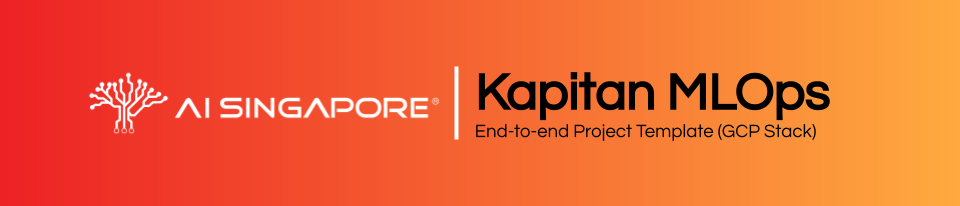

# End-to-end Project Template (GCP Stack)



__Customised for `{{cookiecutter.project_name}}`__.

__Project Description:__ {{cookiecutter.description}}

This template (which also serves as a guide) was generated using the
following
[`cookiecutter`](https://cookiecutter.readthedocs.io/en/stable/)
template:
https://github.com/aisingapore/ml-project-cookiecutter-gcp

This `mkdocs` site is for serving the contents of the end-to-end
guide in a more readable manner, as opposed to plain
Markdown views. The contents of this guide have been customised
according to the inputs provided upon generation of this repository
through the usage of [`cruft`](https://cruft.github.io/cruft/),
following instructions detailed
[here](https://github.com/aisingapore/ml-project-cookiecutter-gcp/blob/master/README.md)
.

Inputs provided to `cookiecutter`/`cruft` for the generation of this
template:

- __`project_name`:__ {{cookiecutter.project_name}}
- __`description`:__ {{cookiecutter.description}}
- __`repo_name`:__ {{cookiecutter.repo_name}}
- __`src_package_name`:__ {{cookiecutter.src_package_name}}
- __`src_package_name_short`:__ {{cookiecutter.src_package_name_short}}
- __`gcp_project_id`:__ {{cookiecutter.gcp_project_id}}
- __`gcr_personal_subdir`:__ {{cookiecutter.gcr_personal_subdir}}
- __`author_name`:__ {{cookiecutter.author_name}}
- __`open_source_license`:__ {{cookiecutter.open_source_license}}

There are __two separate guides__:

- __[User Guide](./guide-for-user/01-prerequisites):__ This guide is for the users of
  the MLOps platforms and toolings.
- __[Admin Guide](./guide-for-admin/01-prerequisites):__ This guide is for
  the administrators and provisioners of the infrastructure required
  for setting up the components of the MLOps platforms and toolings.

## Overview For User Guide

1. [Prerequisites](./guide-for-user/01-prerequisites.md)
2. [Preface](./guide-for-user/02-preface.md)
3. [MLOps Components & Platform](./guide-for-user/03-mlops-components-platform.md)
    - [Kubernetes](./guide-for-user/03-mlops-components-platform.md#kubernetes)
        - [`kubectl` Configuration for GKE](./guide-for-user/03-mlops-components-platform.md#kubectl-configuration-for-gke)
        - [Persistent Volumes](./guide-for-user/03-mlops-components-platform.md#persistent-volumes)
    - [Polyaxon](./guide-for-user/03-mlops-components-platform.md#polyaxon)
        - [Polyaxon Dashboard](./guide-for-user/03-mlops-components-platform.md#polyaxon-dashboard)
        - [Relevant Concepts](./guide-for-user/03-mlops-components-platform.md#relevant-concepts)
        - [Secrets & Credentials on Kubernetes](./guide-for-user/03-mlops-components-platform.md#secrets-credentials-on-kubernetes)
    - [Google Container Registry](./guide-for-user/03-mlops-components-platform.md#google-container-registry)
4. [Development Environment](./guide-for-user/04-dev-env.md)
    - [Recommended Setup](./guide-for-user/04-dev-env.md#recommended-setup)
    - [VSCode](./guide-for-user/04-dev-env.md#vscode)
    - [JupyterLab](./guide-for-user/04-dev-env.md#jupyterlab)
    - [Using Docker within Polyaxon Services](./guide-for-user/04-dev-env.md#using-docker-within-polyaxon-services)
    - [Cloud SDK for Development Environment](./guide-for-user/04-dev-env.md#cloud-sdk-for-development-environment)
5. [Virtual Environment](./guide-for-user/05-virtual-env.md)
6. [Data Storage & Versioning](./guide-for-user/06-data-storage-versioning.md)
    - [Sample Data](./guide-for-user/06-data-storage-versioning.md#sample-data)
7. [Job Orchestration](./guide-for-user/07-job-orchestration.md)
    - [Pipeline Configuration](./guide-for-user/07-job-orchestration.md#pipeline-configuration)
    - [Data Preparation & Preprocessing](./guide-for-user/07-job-orchestration.md#data-preparation-preprocessing)
    - [Model Training](./guide-for-user/07-job-orchestration.md#model-training)
        - [Experiment Tracking](./guide-for-user/07-job-orchestration.md#experiment-tracking)
        - [Container for Experiment Job](./guide-for-user/07-job-orchestration.md#container-for-experiment-job)
        - [Hyperparameter Tuning](./guide-for-user/07-job-orchestration.md#hyperparameter-tuning)
8. [Deployment](./guide-for-user/08-deployment.md)
    - [Model Artifacts](./guide-for-user/08-deployment.md#model-artifacts)
    - [Model Serving (FastAPI)](./guide-for-user/08-deployment.md#model-serving-fastapi)
        - [Local Server](./guide-for-user/08-deployment.md#local-server)
        - [Docker Container](./guide-for-user/08-deployment.md#docker-container)
        - [Deploy to GKE](./guide-for-user/08-deployment.md#deploy-to-gke)
9. [Batch Inferencing](./guide-for-user/09-batch-inferencing.md)
10. [Continuous Integration & Deployment](./guide-for-user/10-cicd.md)
11. [Documentation](./guide-for-user/11-documentation.md)
    - [GitLab Pages](./guide-for-user/11-documentation.md#gitlab-pages)
12. [Streamlit](./guide-for-user/12-streamlit.md)

## Overview for Admin Guide

> Coming soon...

## Directory Tree

```
{{cookiecutter.repo_name}}
    ├── {{cookiecutter.repo_name}}-conda-env.yml
    │                   ^-  The `conda` environment file for reproducing
    │                       the project's development environment.
    ├── LICENSE         <-  The license this repository is to be
    │                       respected under. Can be absent due to
    │                       omission upon generation of repository.
    ├── README.md       <-  The top-level README containing the basic
    │                       guide for using the repository.
    ├── .gitlab-ci.yml  <-  YAML file for configuring instructions for
    │                       GitLab CI/CD.
    ├── .dockerignore   <-  File for specifying files or directories
    │                       to be ignored by Docker contexts.
    ├── .pylintrc       <-  Configurations for `pylint`.
    ├── .gitignore      <-  File for specifying files or directories
    │                       to be ignored by Git.
    ├── aisg-context    <-  Folders containing files and assets relevant
    │   │                   for works within the context of AISG's
    │   │                   development environments.
    │   ├── code-server <-  Directory containing the entry point script
    │   │                   for the VSCode server's Docker image.
    │   ├── guide-site  <-  Files relevant for spinning up the `mkdocs`
    │   │                   site to view the end-to-end guide.
    │   ├── jupyter     <-  Directory containing the entry point scripts
    │   │                   and config for the Jupyter server's Docker
    │   │                   image.
    │   ├── k8s         <-  Manifest files for spinning up Kubernetes
    │   │                   resources.
    │   └── polyaxon    <-  Specification files for services and jobs
    │                       to be executed by the Polyaxon server.
    ├── assets          <-  Screenshots and images.
    ├── conf            <-  Configuration files associated with the
    │                       various pipelines as well as for logging.
    ├── data            <-  Folder to contain any data for the various
    │                       pipelines. Ignored by Git except its
    │                       `.gitkeep` file.
    ├── docker          <-  Dockerfiles associated with the various
    │                       stages of the pipeline.
    ├── docs            <-  A default Sphinx project; see sphinx-doc.org
    │                       for details.
    ├── models          <-  Directory for trained and serialised models.
    ├── notebooks       <-  Jupyter notebooks. Naming convention is a
    │                       number (for ordering), the creator's
    │                       initials, and a short `-` delimited
    │                       description, e.g.
    │                       `1.0-jqp-initial-data-exploration`.
    ├── scripts         <-  Bash scripts for any parts of the pipelines.
    └── src             <-  Directory containing the source code and
        |                   packages for the project repository.
        |── {{cookiecutter.src_package_name}}
        |               ^-  Package containing modules for all pipelines
        |                   except deployment.
        |── {{cookiecutter.src_package_name}}_fastapi
        |               ^-  Package for deploying the predictive models
        |                   within a FastAPI server.
        └── tests       <-  Directory containing tests for the
                            repository's packages.
```

__Reference(s):__

- [Dockerfile reference - `.dockerignore`](https://docs.docker.com/engine/reference/builder/#dockerignore-file)
- [Atlassian's Tutorial on `.gitignore`](https://www.atlassian.com/git/tutorials/saving-changes/gitignore)
- [GitLab CI/CD Quickstart](https://docs.gitlab.com/ee/ci/quick_start/)
- [`pylint` Docs - Command-line Arguments and Configuration Files](https://pylint.pycqa.org/en/latest/user_guide/ide-integration.html?highlight=pylintrc#command-line-arguments-and-configuration-files)
