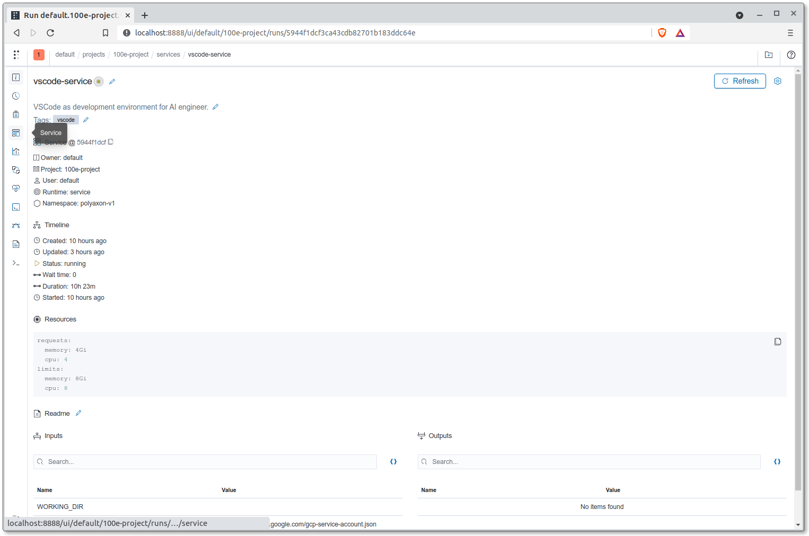
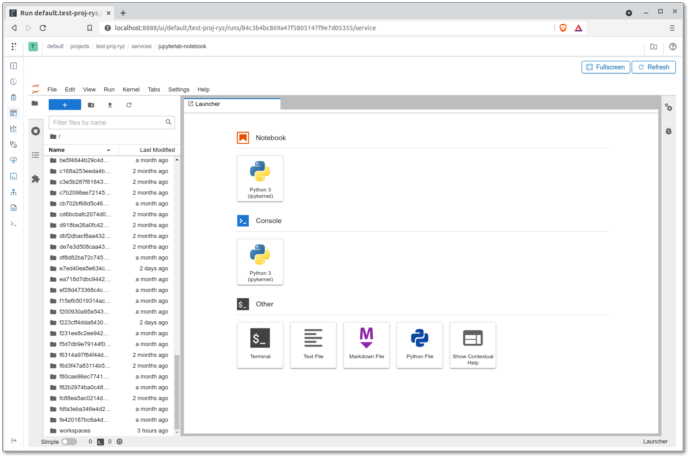

# Development Environment

An advantage presented by the Polyaxon platform is that you can utilise
the GKE cluster's resources for your development and engineering works
instead of your own resources. We can make use of
[Polyaxon services](https://polyaxon.com/docs/experimentation/services/)
to spin up VSCode or Jupyter Lab servers with which cluster resources
can be dedicated (except for GPUs);
all you need on your end is a machine with WebSockets,
a browser and a terminal.

## VSCode

The VSCode service to be created will be using a Docker image. You
can use the Dockerfile that is provided out-of-the-box
`docker/{{cookiecutter.repo_name}}-poly-vscode.Dockerfile` to build a
Docker image to be pushed to your project's container registry (GCR) or
you can customise that same Dockerfile to your liking. Either way, you
are to specify the image to be used for the service.

=== "Linux/macOS"

    ```bash
    $ export GCP_PROJECT_ID={{cookiecutter.gcp_project_id}}
    $ docker build \
      -t asia.gcr.io/$GCP_PROJECT_ID/vscode-server:0.1.0 \
      -f docker/{{cookiecutter.repo_name}}-poly-vscode.Dockerfile \
      --platform linux/amd64 .
    $ docker push asia.gcr.io/$GCP_PROJECT_ID/vscode-server:0.1.0
    ```

=== "Windows PowerShell"

    ```bash
    $ $GCP_PROJECT_ID='{{cookiecutter.gcp_project_id}}'
    $ docker build `
      -t asia.gcr.io/$GCP_PROJECT_ID/vscode-server:0.1.0 `
      -f docker/{{cookiecutter.repo_name}}-poly-vscode.Dockerfile `
      --platform linux/amd64 .
    $ docker push asia.gcr.io/$GCP_PROJECT_ID/vscode-server:0.1.0
    ```

Push the configurations to the Polyaxon server to start up the VSCode
service:

```bash
$ polyaxon run -f aisg-context/polyaxon/polyaxonfiles/vscode-service.yml -P DOCKER_IMAGE="asia.gcr.io/$GCP_PROJECT_ID/vscode-server:0.1.0" -P WORKING_DIR="/polyaxon-v1-data" -p {{cookiecutter.repo_name}}-<YOUR_NAME>
```

The `-p` flag is used to specify the project for which you are
dedicating the service or job to.
The `-P` flag is used to pass an input for a parameter defined in the
Polyaxonfile that is in question. In this case, we are specifying to the
Polyaxon service that we intend to use the Docker image
`asia.gcr.io/$GCP_PROJECT_ID/vscode-server:0.1.0` and to
work from the path that we have
specified, which is `/polyaxon-v1-data` where data and artifacts will
be persisted.

Now head over to the services dashboard under your project. The link to
your services would be as such -
`http://localhost:8888/ui/default/{{cookiecutter.repo_name}}-<YOUR_NAME>/services`
. The interface should look something like the following:


To access the VSCode service, expand the service and click on the
`Service` tab:



The service you see here is embedded within Polyaxon's dashboard.
You can
click on the `Fullscreen` button to have a single browser tab be
dedicated to this service.


To open up the integrated terminal within the VSCode environment, you
can use the keyboard shortcut <code>Ctrl + Shift + `</code>.

### Git from VSCode

To clone or push to Git repositories within the VSCode integrated
terminal, you would have to first disable VSCode's Git authentication
handler:

1. Head over to `File > Preferences > Settings`.
2. Search for `git.terminalAuthentication`.
3. Uncheck the option.
4. Open a new integrated terminal.

## Jupyter Lab

While Jupyter Notebooks are viewable, editable and executable within
a VSCode environment, most are still more familiar with Jupyter's
interface for interacting with or editing notebooks. We can spin up
a Jupyter Lab service on Polyaxon:

=== "Linux/macOS"

    ```bash
    $ export GCP_PROJECT_ID={{cookiecutter.gcp_project_id}}
    $ docker build \
      -t asia.gcr.io/$GCP_PROJECT_ID/jupyter:0.1.0 \
      -f docker/{{cookiecutter.repo_name}}-poly-jupyter.Dockerfile \
      --platform linux/amd64 .
    $ docker push asia.gcr.io/$GCP_PROJECT_ID/jupyter:0.1.0
    ```

=== "Windows PowerShell"

    ```powershell
    $ $GCP_PROJECT_ID={{cookiecutter.gcp_project_id}}
    $ docker build `
      -t asia.gcr.io/$GCP_PROJECT_ID/jupyter:0.1.0 `
      -f docker/{{cookiecutter.repo_name}}-poly-jupyter.Dockerfile `
      --platform linux/amd64 .
    $ docker push asia.gcr.io/$GCP_PROJECT_ID/jupyter:0.1.0
    ```

Push the configurations to the Polyaxon server to start up the Jupyter
service:

```bash
$ polyaxon run -f aisg-context/polyaxon/polyaxonfiles/jupyter-service.yml -P DOCKER_IMAGE="asia.gcr.io/$GCP_PROJECT_ID/jupyter:0.1.0" -P WORKING_DIR="/polyaxon-v1-data" -p {{cookiecutter.repo_name}}-<YOUR_NAME>
```

Now head over to the services dashboard under your project.
The service should be accompanied with the tags `jupyter`,
`notebook` and `lab`.



## Using Docker within Polyaxon Services

!!! caution

    A caveat: since these development environments are essentially pods
    deployed within a Kubernetes cluster, using Docker within the pods
    themselves is not feasible by default and while possible,
    should be avoided.

__Reference(s):__

- [Polyaxon Docs - Run CLI Reference](https://polyaxon.com/docs/core/cli/run/)
- [Polyaxon - Integrations](https://polyaxon.com/integrations/)
- [Cloud SDK Reference - gcloud auth activate-service-account](https://cloud.google.com/sdk/gcloud/reference/auth/activate-service-account)
- [Using Docker-in-Docker for your CI or testing environment? Think twice. - jpetazzo](https://jpetazzo.github.io/2015/09/03/do-not-use-docker-in-docker-for-ci/)

## Git Repository

Now that we have a development environment, we can clone this repository
into the environment's persistent storage. As the persistent storage
would be accessible by the rest of your project team members, __you
should only use the `HTTPS` protocol to clone the repository__
as opposed to using an `SSH` key.

The path to persistent storage on Polyaxon is located at
`/polyaxon-v1-data`. You can create your own workspace folder under
`/polyaxon-v1-data/workspaces/<YOUR_NAME>`:

=== "Polyaxon VSCode Terminal"

    ```bash
    $ sudo mkdir -p /polyaxon-v1-data/workspaces/<YOUR_NAME>
    $ sudo chown -R 2222:2222 /polyaxon-v1-data/workspaces
    $ cd /polyaxon-v1-data/workspaces/<YOUR_NAME>
    $ git clone <REMOTE_URL_HTTPS>
    $ cd {{cookiecutter.repo_name}}
    ```

## Cloud SDK for Development Environment

As mentioned
[here](./03-mlops-components-platform.md#secrets-credentials-on-kubernetes),
credentials or secrets can be attached to Polyaxon services or jobs
when configured properly. In doing so, you can make use of Google
service accounts to interact with GCP services or resources.

If you use the provided Dockerfiles to build Docker images for the
services on Polyaxon, the development environments would have the
Cloud SDK installed.
You can configure the `gcloud` CLI to make use of the
service account credentials attached to the VSCode and Jupyter services,
which its path is set to the environment variable
`GOOGLE_APPLICATION_CREDENTIALS`:

```bash
$ gcloud auth activate-service-account aisg-100e-sa@{{cookiecutter.gcp_project_id}}.iam.gserviceaccount.com --key-file=$GOOGLE_APPLICATION_CREDENTIALS
```

Once the service account has been configured, examples of actions you
can carry out consists of the following:

- list objects within GCS buckets
- create objects within GCS buckets
- list deployed pods within a GKE cluster

The service account is granted a custom role with specific
permissions deemed needed by AI engineers.
