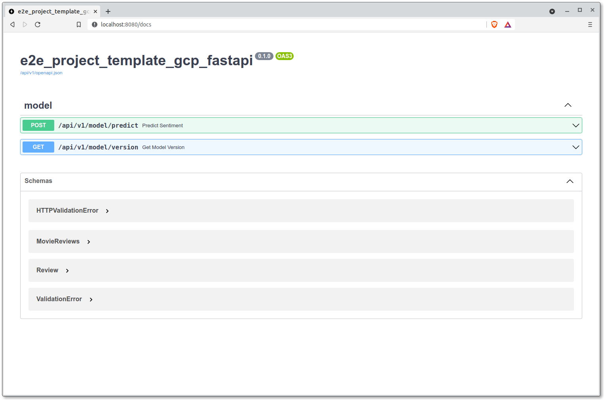

# Deployment

Assuming we have a predictive model that we are satisfied with, we can
serve the model within a REST API with which requests can be made to
and we will be provided with predictions.

Python has plenty of web frameworks that we can leverage on to build
our REST API. Popular examples include
[Flask](https://flask.palletsprojects.com/en/2.0.x/),
[Django](https://www.djangoproject.com/) and
[Starlette](https://www.starlette.io/). For this guide however, we will
resort to the following options:
the well-known [FastAPI](https://fastapi.tiangolo.com/) (which is based
on Starlette itself) and an in-house implementation of
[Seldon Core](https://www.seldon.io/tech/products/core/), Kapitan
Scout.

__Reference(s):__

- [IBM Technology - What is a REST API? (Video)](https://www.youtube.com/watch?v=lsMQRaeKNDk)

## Model Artifacts

Seen in
["Model Training"](./07-job-orchestration.md#model-training)
, we have the trained models
uploaded to GCS through the MLflow Tracking server (done through
autolog). By default, each experiment run is given a unique ID. When
artifacts uploaded to GCS through MLflow, the artifacts are located
within directories named after the unique IDs of the runs.
This guide by default uploads your artifacts to the following
directory on GCS:
`gs://{{cookiecutter.repo_name}}-artifacts/mlflow-tracking-server`.
Artifacts for specific runs will be uploaded to a directory with the
following convention:
`gs://{{cookiecutter.repo_name}}-artifacts/mlflow-tracking-server/<MLFLOW_EXPERIMENT_UUID>`.
With this path/URI, we can use
[`gsutil`](https://cloud.google.com/storage/docs/gsutil)
to download the predictive model from GCS into a mounted volume when
we run the Docker image for the REST APIs.

Now that we have established on how we are to obtain the models for the
API server, let's look into the servers themselves.

## Model Serving (FastAPI)

FastAPI is a web framework that has garnered much popularity in recent
years due to ease of adoption due to its comprehensive tutorials, type
and schema validation, async capable and automated docs, among other
things. These factors have made it a popular framework within
AI Singapore across many projects.

If you were to inspect the `src` folder, you would notice that there
exist more than one package: `{{cookiecutter.src_package_name}}` and
`{{cookiecutter.src_package_name}}_fastapi`. The former contains the modules for
executing pipelines like data preparation and model training while
the latter is dedicated to modules meant for the REST API. Regardless,
the packages can be imported by each other.

__Note:__ It is recommended that you grasp some basics of the FastAPI
framework, up till the
[beginner tutorials](https://fastapi.tiangolo.com/tutorial/) for
better understanding of this section.

Let's try running the boilerplate API server on a local machine.
Before doing that, identify from the MLflow dashboard the unique ID
of the experiment run that resulted in the predictive model that you
would like to serve.


Now that we have obtained the ID of the MLflow run,
let's download the model that we intend to serve.
Assuming you're in the root of this template repository, execute the
following commands:

```bash
$ export PRED_MODEL_UUID="<MLFLOW_EXPERIMENT_UUID>"
$ export PRED_MODEL_GCS_URI="gs://{{cookiecutter.repo_name}}-artifacts/mlflow-tracking-server/$PRED_MODEL_UUID"
$ gsutil cp -r $PRED_MODEL_GCS_URI ./models
```

With the above, the model for the experiment
`7251ac3655934299aad4cfebf5ffddbe` is downloaded to the subdirectory
`./models`. However, the subdirectory that is relevant for TensorFlow
to load will be
`./models/<MLFLOW_EXPERIMENT_UUID>/artifacts/model/data/model`. Let's
export this path to an environment variable:

```bash
$ export PRED_MODEL_PATH="$PWD/models/$PRED_MODEL_UUID/artifacts/model/data/model"
```

### Local Server

Run the FastAPI server using [Gunicorn](https://gunicorn.org):

```bash
$ cd src
$ gunicorn {{cookiecutter.src_package_name}}_fastapi.main:APP -b 0.0.0.0:8080 -w 4 -k uvicorn.workers.UvicornWorker
```

__Note:__ See
[here](https://fastapi.tiangolo.com/deployment/server-workers/) as to
why Gunicorn is being used instead of just
[Uvicorn](https://www.uvicorn.org/). TLDR: Gunicorn is needed to spin
up multiple processes/workers to handle more requests i.e. better for
the sake of production needs.

In another terminal, use the `curl` command to submit a request to the API:

```bash
$ curl -H 'Content-Type: application/json' -H 'accept: application/json' \
  -X POST -d '{"reviews": [{"id": 9176, "text": "This movie is quite boring."}, {"id": 71, "text": "This movie is awesome."}]}' \
  localhost:8080/api/v1/model/predict
```

With the returned JSON object, we have successfully submitted a request
to the FastAPI server and it returned predictions as part of the
response.

Now you might be wondering, how does the FastAPI server knows the path
to the model for it to load? FastAPI utilises
[Pydantic](https://pydantic-docs.helpmanual.io/), a library for data
and schema validation as well as settings management. There's a class
called `Settings` under the module
`src/{{cookiecutter.src_package_name}}_fastapi/config.py`. This class contains
several fields: some are defined and some others not. The fields
`PRED_MODEL_UUID` and `PRED_MODEL_PATH` inherit their values from
the environment variables. This means that the export commands we
executed above were for setting the values for the server to refer to.

FastAPI automatically generates interactive API documentation for
easy viewing of all the routers/endpoints you have made available for
the server. You can view the documentation through
`<API_SERVER_URL>:<PORT>/docs`. In our case here, it is viewable through
[`localhost:8080/docs`](http://localhost:8080/docs). It will look like
such:



### Docker Container

We now look into packaging the server within a Docker container. This
process of containerising the server isn't just for the sake of
reproducibility but it makes it easier for the server to be deployed
on any server that can run a Docker container. A boilerplate
Dockerfile is provided to containerise the FastAPI server:

```bash
# Ensure that you are in the root of the repository
$ docker build \
  -t asia.gcr.io/$GCP_PROJECT_ID/fastapi-server:0.1.0 \
  --build-arg PRED_MODEL_UUID="$PRED_MODEL_UUID" \
  -f docker/{{cookiecutter.repo_name}}-fastapi.Dockerfile .
```

The Docker build command above requires an argument to be passed and it
is basically the same unique MLflow run ID that was used above.
The ID would then be used to create environment variables that would
persist beyond the build time. When the container is being run,
these environment variables would be
used by the entrypoint script to download the relevant predictive model
into the mounted volumes and be referred to by the FastAPI Pydantic
models. Let's try running the Docker container:

```bash
# First make the `models` folder accessible to user within Docker container
$ sudo chgrp -R 2222 models
$ docker run --rm -p 8080:8080 \
  -v <PATH_TO_SA_JSON_FILE>:/var/secret/cloud.google.com/gcp-service-account.json \
  -v $PWD/models:/home/aisg/from-gcs \
  --env GOOGLE_APPLICATION_CREDENTIALS=/var/secret/cloud.google.com/gcp-service-account.json \
  asia.gcr.io/$GCP_PROJECT_ID/fastapi-server:0.1.0
```

Let's go through a couple of the flags used above:

- `--rm`: Automatically stops the container when it exits or when you
  stop it.
- `-p`: This binds port `8080` of the container to port `8080` of the
  host machine.
- `-v`: Bind mounts files or directories from the host machine to the
  container. In this case, we are mounting the SA file and the `models`
  folder to the container. The SA file is needed for `gsutil`
  to download the model from GCS and the `models` folder will persist
  the downloaded models.
- `--env`: This sets environment variables within the container.

Use the same `curl` command for the server spun up by the container:

```bash
$ curl -H 'Content-Type: application/json' -H 'accept: application/json' \
  -X POST -d '{"reviews": [{"id": 9176, "text": "This movie is quite boring."}, {"id": 71, "text": "This movie is awesome."}]}' \
  localhost:8080/api/v1/model/predict
```

Push the Docker image to the GCR:

```bash
$ docker push asia.gcr.io/$GCP_PROJECT_ID/fastapi-server:0.1.0
```

With this Docker image, you can spin up a VM (Compute Engine instance)
that has Docker installed and run the container on it for deployment.
You can also deploy the image within a Kubernetes cluster for ease of
scaling.

### Deploy to GKE

To deploy the FastAPI server on GKE, you can make use of the sample
Kubernetes manifest files provided with this template:

```bash
$ kubectl apply -f aisg-context/k8s/model-serving-api/fastapi-server-deployment.yml --namespace=polyaxon-v1
$ kubectl apply -f aisg-context/k8s/model-serving-api/fastapi-server-service.yml --namespace=polyaxon-v1
```

To access the server, you can port-forward the service to a local port
like such:

```bash
$ kubectl port-forward service/fastapi-server-svc 8080:8080 --namespace=polyaxon-v1
Forwarding from 127.0.0.1:8080 -> 8080
Forwarding from [::1]:8080 -> 8080
```

You can view the documentation for the API at
[`http://localhost:8080/docs`](http://localhost:8080/docs). You can also
make a request to the API like so:

```bash
$ curl -H 'Content-Type: application/json' -H 'accept: application/json' \
  -X POST -d '{"reviews": [{"id": 9176, "text": "This movie is quite boring."}, {"id": 71, "text": "This movie is awesome."}]}' \
  localhost:8080/api/v1/model/predict
```

__Reference(s):__

- [FastAPI Docs](https://fastapi.tiangolo.com)
- [Pydantic Docs - Settings Management](https://pydantic-docs.helpmanual.io/usage/settings/)
- [TensorFlow Docs - `tf.keras.models.load_model`](https://www.tensorflow.org/api_docs/python/tf/keras/models/load_model)
- [`curl` tutorial](https://curl.se/docs/manual.html)
- [`docker run` Reference](https://docs.docker.com/engine/reference/commandline/run/)

## Model Serving (Kapitan Scout)

> Coming soon...
