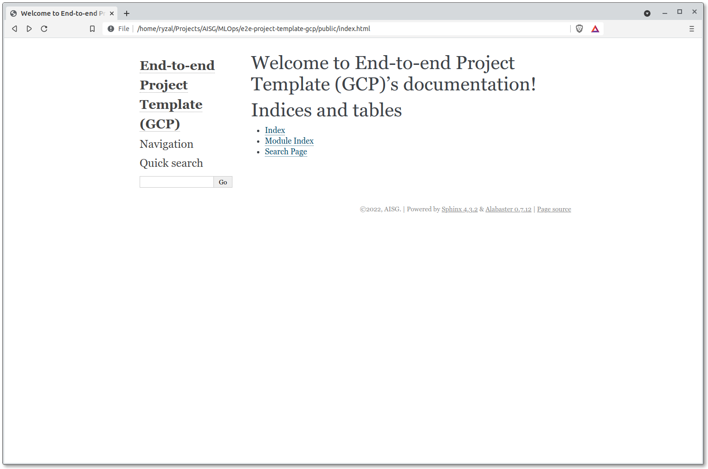

# Documentation

The boilerplate packages generated by the template are populated with
some
[Numpy formatted docstrings](https://numpydoc.readthedocs.io/en/latest/format.html#docstring-standard)
. What we can do with this is to observe how
documentation can be automatically generated using
[Sphinx](https://www.sphinx-doc.org/en/master/)
, with the aid of the
[Napoleon](https://www.sphinx-doc.org/en/master/usage/extensions/napoleon.html)
extension. Let's build the HTML asset for the documentation:

```bash
# From the root folder
$ sphinx-apidoc -f -o docs src
$ sphinx-build -b html docs public
```



## GitLab Pages

Documentation generated through Sphinx can be served on
[GitLab Pages](https://docs.gitlab.com/ee/user/project/pages/), through
GitLab CI/CD. With this template, a default CI job has written under
`.gitlab-ci.yml` to serve the Sphinx documentation when pushes are
done to the `master` branch:

```yaml
...
pages:
  stage: deploy-docs
  image:
    name: continuumio/miniconda:4.7.12
  script:
  - conda env update -f {{cookiecutter.repo_name}}-conda-env.yml
  - conda init bash
  - source ~/.bashrc
  - conda activate {{cookiecutter.repo_name}}
  - sphinx-apidoc -f -o docs src
  - sphinx-build -b html docs public
  artifacts:
    paths:
    - public
  only:
  - master
...
```

The documentation page is viewable through the following convention:
`<GROUP>.gitlab.aisingapore.net/<PROJECT_NAME>` or
`<GROUP>.gitlab.aisingapore.net/<SUBGROUP>/<PROJECT_NAME>`.

__Reference(s):__

- [GitLab Docs - Pages domain names, URLs, and base URLs](https://docs.gitlab.com/ee/user/project/pages/getting_started_part_one.html)
